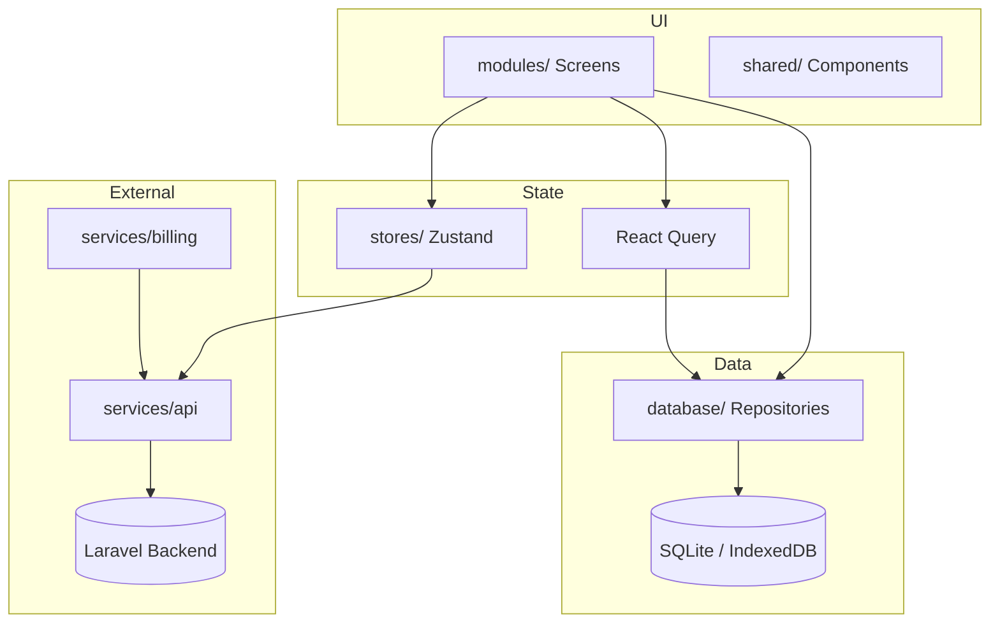

# ساختار پروژه و معماری سیستم — فریلنس پلاس

این سند توضیح می‌دهد اپلیکیشن **فریلنس پلاس** (FreelancerPro) از نظر ساختار فولدرها، جریان اجرا، لایه‌های نرم‌افزار و ارتباط بین بخش‌ها چگونه سازمان‌دهی شده است.

---

## ۱. نمای کلی

**فریلنس پلاس** یک اپلیکیشن مدیریت مالی و حسابداری برای فریلنسرهای ایرانی است. کاربر می‌تواند مشتری، پروژه، پرداخت، فاکتور، هزینه و خدمات را مدیریت کند؛ گزارش مالی ببیند؛ فاکتور PDF/PNG صادر کند؛ و داده‌ها را پشتیبان‌گیری/بازیابی کند.

| مورد | مقدار |
|------|--------|
| نام محصول | فریلنس پلاس |
| فریم‌ورک | React Native + Expo SDK 56 |
| زبان | TypeScript (strict) |
| پلتفرم‌ها | Android، iOS، Web |
| جهت UI | RTL کامل (فارسی) |
| ذخیره‌سازی اصلی | SQLite (`expo-sqlite`) — Offline First |
| احراز هویت | OTP موبایل ایران + JWT (اختیاری، با بک‌اند) |
| مدل درآمد | Free / Pro + دوره آزمایشی ۳ روزه |

---

## ۲. پشته فناوری

| لایه | ابزار |
|------|--------|
| UI | React Native Paper (Material Design 3) |
| ناوبری | React Navigation 7 (Bottom Tabs + Native Stack) |
| فرم‌ها | React Hook Form + Zod |
| State سراسری | Zustand |
| کش و Query | TanStack React Query |
| دیتابیس | expo-sqlite (موبایل) / IndexedDB (وب) |
| تاریخ شمسی | jalaali-js + ابزارهای `core/utils/persian` |
| نمودار | Victory Native / SimpleBarChart |
| فونت | IRANYekanX (فارسی با اعداد فارسی) |
| امنیت توکن | expo-secure-store (موبایل) / localStorage (وب) |
| پرداخت | کافه‌بازار (Android) / زیبال (Web) |
| خروجی فاکتور | expo-print، jspdf، html-to-image |
| اعلان | expo-notifications (یادآوری محلی) |

---

## ۳. ساختار درختی پروژه

```
android-app-freelancer/
├── App.tsx                 # نقطه ورود UI — RTL، NavigationContainer، AppGate
├── index.ts                # registerRootComponent + تنظیم dir/lang روی وب
├── app.json                # پیکربندی Expo
├── assets/                 # آیکون، فونت، تصاویر
├── docs/                   # مستندات فنی (API، انتشار، این سند)
├── public/                 # فایل‌های استاتیک وب (splash، index.html)
├── src/
│   ├── core/               # هسته مشترک: تایپ، تم، ثابت‌ها، ابزارها
│   ├── database/           # SQLite: schema، connection، repositories
│   ├── hooks/              # هوک‌های ترکیبی (auth، subscription)
│   ├── modules/            # صفحات feature-based
│   ├── navigation/         # ناوبری: RootNavigator، stacks، types
│   ├── services/           # منطق بیرونی: API، auth، billing، cloud
│   ├── shared/             # کامپوننت‌ها و Providerهای مشترک
│   └── stores/             # Zustand stores
├── babel.config.js         # alias @ → src
├── tsconfig.json           # path alias @/*
└── package.json
```

### Alias مسیرها

در `tsconfig.json` و `babel.config.js` مسیر `@/*` به `src/*` نگاشت شده است:

```ts
import { clientRepository } from '@/database';
import { useAuthStore } from '@/stores/authStore';
```

---

## ۴. معماری لایه‌ای

اپ از الگوی **Feature-based + Layered Architecture** پیروی می‌کند:

```
┌─────────────────────────────────────────────────────────┐
│  modules/          (صفحات و UI هر فیچر)                  │
├─────────────────────────────────────────────────────────┤
│  shared/           (کامپوننت‌ها، Providerها)             │
├─────────────────────────────────────────────────────────┤
│  hooks/ + stores/  (state سراسری و هوک‌های ترکیبی)     │
├─────────────────────────────────────────────────────────┤
│  services/         (API، auth، billing، cloud sync)     │
├─────────────────────────────────────────────────────────┤
│  database/         (repositories + SQLite)              │
├─────────────────────────────────────────────────────────┤
│  core/             (types، utils، theme، constants)     │
└─────────────────────────────────────────────────────────┘
```

**اصل طراحی:** داده‌های مالی همیشه ابتدا در SQLite ذخیره می‌شوند (Offline First). بک‌اند فعلاً برای **احراز هویت**، **اشتراک Pro** و **ترجیحات ابری** استفاده می‌شود؛ همگام‌سازی کامل CRUD ابری در فاز بعدی تعریف شده (`docs/CLOUD_SYNC_API.md`).

---

## ۵. جریان راه‌اندازی اپ (Bootstrap)

```
index.ts
  └─ dir=rtl, lang=fa (وب)
  └─ registerRootComponent(App)

App.tsx
  └─ I18nManager.forceRTL (موبایل)
  └─ AppProviders
       ├─ GestureHandlerRootView
       ├─ SafeAreaProvider
       ├─ QueryClientProvider
       ├─ DatabaseProvider  ← init DB + seed + load stores
       └─ PaperProvider (تم روشن/تاریک)
  └─ NavigationContainer (direction=rtl)
       └─ ResponsiveShell (محدودیت عرض روی وب دسکتاپ)
            └─ AppGate
```

### AppGate — دروازه ورود به اپ

`AppGate` ترتیب نمایش صفحات را تعیین می‌کند:

1. **بارگذاری** — تا `authStore` و `storageModeStore` آماده شوند → `AppSplash`
2. **مهمان** — اگر API پیکربندی شده و کاربر لاگین نیست → `AuthNavigator`
3. **انتخاب حالت ذخیره** — کاربر جدید باید local/cloud را انتخاب کند → `StorageModeSetupScreen`
4. **اپ اصلی** — `RootNavigator` (تب‌های پایین)

### DatabaseProvider — مقداردهی اولیه

هنگام mount:

1. `getDatabase()` — باز کردن `freelancerpro.db` + migration
2. `seedSampleData()` — اگر دیتابیس خالی باشد، داده نمونه seed می‌شود
3. بارگذاری storeها: `themeStore`، `profileStore`، `subscriptionStore`، `storageModeStore`، `onboardingStore`
4. نمایش `OnboardingOverlay` در صورت نیاز

---

## ۶. ناوبری (Navigation)

### ساختار کلی

```
RootNavigator (Bottom Tabs)
├── Dashboard          → DashboardScreen
├── Clients            → ClientsStack
├── Projects           → ProjectsStack
├── Invoices           → InvoicesStack
├── Reports            → ReportsScreen
└── More               → MoreStack
```

### استک‌های تو در تو

| استک | صفحات |
|------|--------|
| **AuthStack** | Login → Otp |
| **ClientsStack** | ClientsList → ClientForm → ClientDetail |
| **ProjectsStack** | ProjectsList → ProjectForm → ProjectDetail → PaymentForm |
| **InvoicesStack** | InvoicesList → InvoiceForm → InvoiceDetail |
| **MoreStack** | MoreMenu → Expenses، Services، Reports، Calculator، Notifications، Backup، Profile، Settings، InvoiceStyle، Subscription |

تایپ‌های پارامتر ناوبری در `src/navigation/types.ts` تعریف شده‌اند.

---

## ۷. لایه دیتابیس

### فایل‌های کلیدی

| فایل | نقش |
|------|-----|
| `schema.ts` | DDL جداول + `SCHEMA_VERSION` |
| `connection.ts` | singleton DB، migration، reset |
| `repositories/*.ts` | CRUD هر موجودیت |
| `sampleData.ts` | داده نمونه اولین اجرا |
| `analyticsRepository.ts` | آمار داشبورد و گزارش‌ها |

### مدل داده (ER ساده)

```
clients ──┬── projects ── payments
          │
          └── invoices ── invoice_items ── services (اختیاری)

expenses (مستقل)
profile (تک رکورد)
app_settings (تک رکورد)
```

### جداول اصلی

| جدول | توضیح |
|------|--------|
| `clients` | مشتری/کارفرما |
| `projects` | پروژه با مبلغ کل، دریافتی، باقیمانده، وضعیت |
| `payments` | پرداخت‌های دریافتی از مشتری (وابسته به پروژه) |
| `services` | کاتالوگ خدمات |
| `invoices` + `invoice_items` | فاکتور و اقلام |
| `expenses` | هزینه‌های شخصی/کاری |
| `profile` | پروفایل فریلنسر + تنظیمات فاکتور |
| `app_settings` | تم، اشتراک، onboarding، حالت ذخیره |
| `schema_version` | نسخه migration |

### الگوی Repository

هر repository از `BaseRepository` ارث می‌برد و متدهایی مثل `getAll`، `getById`، `create`، `update`، `delete`، `count` دارد. مثال: `clientRepository`.

**Migration:** در `connection.ts` ابتدا `CREATE TABLE IF NOT EXISTS` اجرا می‌شود، سپس `ALTER TABLE`های افزایشی (با try/catch برای ستون‌های موجود).

**وب:** در صورت خطای Access Handle، دیتابیس حذف و دوباره ساخته می‌شود.

---

## ۸. مدیریت State

### Zustand Stores

| Store | مسئولیت |
|-------|---------|
| `authStore` | وضعیت لاگین، OTP، session |
| `subscriptionStore` | پلن Free/Pro، محدودیت‌ها، trial |
| `profileStore` | پروفایل کاربر (نام، لوگو، ارز، مالیات) |
| `themeStore` | حالت تاریک/روشن |
| `storageModeStore` | local vs cloud |
| `onboardingStore` | راهنمای اولین ورود |

### React Query

برای داده‌های **تحلیلی و گزارشی** (داشبورد، نمودار، گزارش مشتری/خدمت) استفاده می‌شود. کلیدها و invalidation در `core/query/analyticsQueries.ts` متمرکز شده‌اند.

- `staleTime: 0` برای آمار زنده
- `useRefetchAnalyticsOnFocus` — با focus صفحه، داده تازه می‌شود

**تفکیک:** داده‌های CRUD مستقیم از repository خوانده/نوشته می‌شوند؛ Query فقط برای aggregation و cache خواندنی.

---

## ۹. لایه Services

```
src/services/
├── api/
│   ├── ApiClient.ts          # fetch wrapper + refresh token
│   ├── types.ts              # تایپ‌های API
│   └── normalizeAuthResponse.ts
├── auth/
│   ├── AuthService.ts        # OTP send/verify، me، logout
│   ├── OtpService.ts         # نرمال‌سازی شماره/کد
│   ├── DeviceService.ts      # device_id
│   └── syncAuthProfile.ts    # همگام پروفایل auth → SQLite
├── billing/
│   ├── BazaarBillingService.ts
│   ├── ZibalPaymentService.ts
│   └── subscriptionPlans.ts
├── subscription/
│   ├── SubscriptionService.ts      # خرید، restore، web return
│   ├── SubscriptionSyncService.ts  # sync plan از سرور
│   └── trialService.ts             # ۳ روز trial
├── cloud/
│   └── storageModeService.ts       # local/cloud preferences
├── storage/
│   └── StorageService.ts           # SecureStore / localStorage
└── data/
    └── dataResetService.ts         # پاک‌سازی داده
```

### ApiClient

- Base URL از `EXPO_PUBLIC_API_URL`
- هدرهای `X-Platform`، `X-App-Version`، `Accept-Language: fa`
- Refresh خودکار توکن روی 401
- اگر API پیکربندی نشده باشد، auth غیرفعال می‌ماند

---

## ۱۰. ماژول‌های فیچر (modules/)

هر ماژول معمولاً شامل **Screen**ها و گاهی **service/helper** اختصاصی خودش است:

| ماژول | مسئولیت |
|-------|---------|
| `auth/` | Login، OTP، AuthNavigator |
| `dashboard/` | آمار مالی، نمودار ۶ ماهه (Pro) |
| `clients/` | CRUD مشتری، جزئیات |
| `projects/` | CRUD پروژه، Progress Bar، ماشین‌حساب |
| `payments/` | ثبت پرداخت روی پروژه |
| `invoices/` | CRUD فاکتور، قالب، export PDF/PNG |
| `services/` | کاتالوگ خدمات |
| `expenses/` | ثبت هزینه‌ها |
| `reports/` | گزارش درآمد، مشتری، خدمت |
| `backup/` | export/import JSON |
| `subscription/` | خرید Pro، restore |
| `notifications/` | یادآوری محلی |
| `settings/` | پروفایل، تم، storage mode، reset |

### جریان داده نمونه — ثبت پرداخت

```
PaymentFormScreen
  → paymentRepository.create()
  → projectRepository.updateAmounts()  (receivedAmount / remainingAmount)
  → invalidateAnalyticsQueries()       (تازه‌سازی داشبورد)
```

### جریان فاکتور

```
InvoiceFormScreen → invoiceRepository
InvoiceDetailScreen → InvoiceDocument (رندر HTML)
invoiceExport.ts / invoiceExport.web.ts → PDF یا PNG
invoiceTemplate.ts → قالب classic / modern / minimal
```

---

## ۱۱. کامپوننت‌های مشترک (shared/)

| کامپوننت | کاربرد |
|----------|--------|
| `ScreenContainer` | قالب صفحه |
| `StatCard` | کارت آمار داشبورد |
| `FormTextInput`، `CurrencyInput` | ورودی فرم |
| `JalaliDateField` | انتخاب تاریخ شمسی |
| `ClientPickerField` | انتخاب مشتری |
| `SearchBar`، `FilterChips` | فیلتر لیست |
| `EmptyState`، `Skeleton` | حالت خالی/بارگذاری |
| `FAB` | دکمه شناور افزودن |
| `TrialBanner` | بنر دوره آزمایشی |
| `OnboardingOverlay` | راهنمای اولیه |
| `AppGate`، `AppSplash` | bootstrap UI |
| `ResponsiveShell` | layout وب دسکتاپ |

### Providers

- `AppProviders` — Query، Database، Theme
- `DatabaseProvider` — init DB + onboarding

---

## ۱۲. هسته (core/)

```
core/
├── config/env.ts       # API_BASE_URL، BAZAAR_RSA، IS_API_CONFIGURED
├── constants/          # محدودیت Free، برچسب‌ها، رنگ‌ها
├── types/              # Client، Project، Invoice، ...
├── theme/              # lightTheme، darkTheme، RTL layout
├── utils/
│   ├── persian.ts      # اعداد فارسی/لاتین، تاریخ شمسی
│   ├── currency.ts     # formatCurrency
│   ├── date.ts         # dayjs
│   ├── invoice.ts      # محاسبات فاکتور
│   └── project.ts      # محاسبات پروژه
├── hooks/
│   ├── useResponsive.ts
│   └── useDebouncedValue.ts
├── platform/
│   ├── paymentPlatform.ts  # bazaar | zibal | unsupported
│   └── webQuery.ts         # query string وب
└── query/
    └── analyticsQueries.ts
```

---

## ۱۳. احراز هویت

```
کاربر شماره وارد می‌کند
  → authStore.sendOtp()
  → AuthService → POST /api/auth/otp/send
  → OtpScreen

کاربر کد را وارد می‌کند
  → authStore.verifyOtp()
  → AuthService → POST /api/auth/otp/verify
  → ذخیره access/refresh token در StorageService
  → syncAuthUserToProfile()
  → subscriptionSyncService.applyFromMe()
  → اگر کاربر جدید: storageModeService.prepareNewUserSetup()
```

**بدون بک‌اند:** اگر `EXPO_PUBLIC_API_URL` خالی باشد، `IS_API_CONFIGURED = false` و اپ بدون لاگین مستقیم به محتوا می‌رود (فقط local).

**توکن:** موبایل در SecureStore؛ وب در localStorage.

---

## ۱۴. اشتراک و محدودیت‌ها

### پلن‌ها

| ویژگی | Free | Pro |
|-------|------|-----|
| مشتری | ۳ | نامحدود |
| پروژه | ۵ | نامحدود |
| فاکتور | ۱۰ | نامحدود |
| PDF/PNG | ✗ | ✓ |
| گزارش‌ها و نمودار | ✗ | ✓ |
| پشتیبان‌گیری | ✗ | ✓ |
| چند ارزی | ✗ | ✓ |

### Trial

۳ روز دسترسی Pro برای کاربران جدید (`TRIAL_DAYS = 3`).

### پرداخت

| پلتفرم | درگاه |
|--------|--------|
| Android | کافه‌بازار (`BazaarBillingService`) |
| Web | زیبال (`ZibalPaymentService`) |
| iOS | فعلاً unsupported |

وضعیت اشتراک در `app_settings` (SQLite) و `StorageService` (meta) نگه‌داری و با API سینک می‌شود.

---

## ۱۵. حالت ذخیره‌سازی (Storage Mode)

| حالت | توضیح |
|------|--------|
| `local` | داده فقط روی دستگاه (SQLite / IndexedDB) |
| `cloud` | ترجیح همگام‌سازی با سرور فریلنس پلاس |

کاربر جدید پس از OTP باید در `StorageModeSetupScreen` انتخاب کند. ترجیح در `app_settings.dataStorageMode` ذخیره و به `PUT /api/user/preferences` ارسال می‌شود.

> **توجه:** CRUD ابری کامل هنوز در اپ پیاده نشده؛ فعلاً داده مالی local است.

---

## ۱۶. پشتیبانی فارسی و RTL

- `I18nManager.forceRTL(true)` روی موبایل
- `document.documentElement dir=rtl lang=fa` روی وب
- `NavigationContainer direction="rtl"`
- فونت `IRANYekanX` با اعداد فارسی
- تاریخ شمسی با `jalaali-js`
- `core/utils/persian.ts` برای تبدیل ارقام و فرمت

---

## ۱۷. تفاوت پلتفرم‌ها

| موضوع | Android/iOS | Web |
|-------|-------------|-----|
| دیتابیس | SQLite native | IndexedDB (همان نام DB) |
| توکن | SecureStore | localStorage |
| پرداخت | کافه‌بازار | زیبال |
| export فاکتور | `invoiceExport.ts` | `invoiceExport.web.ts` |
| layout | تمام عرض | ResponsiveShell با max-width |
| splash | native | HTML splash در `public/` |

---

## ۱۸. متغیرهای محیطی

| متغیر | کاربرد |
|-------|--------|
| `EXPO_PUBLIC_API_URL` | آدرس بک‌اند |
| `EXPO_PUBLIC_BAZAAR_RSA_KEY` | کلید RSA کافه‌بازار |
| `EXPO_PUBLIC_WEB_APP_URL` | URL اپ وب (redirect پرداخت) |
| `EXPO_PUBLIC_APP_ENV` | production / development |

---

## ۱۹. اسکریپت‌ها

```bash
npm start          # expo start
npm run android    # expo run:android
npm run ios        # expo run:ios
npm run web        # expo start --web
npm run build      # export وب
npm run build:apk  # EAS build اندروید
```

---

## ۲۰. مستندات مرتبط

| سند | موضوع |
|-----|--------|
| `README.md` | راهنمای سریع |
| `docs/BACKEND_API.md` | API احراز هویت و اشتراک |
| `docs/LARAVEL_BACKEND.md` | پیاده‌سازی Laravel |
| `docs/CAFE_BAZAAR_RELEASE.md` | انتشار کافه‌بازار |
| `docs/DATA_RESET_API.md` | API پاک‌سازی داده |
| `docs/CLOUD_SYNC_API.md` | همگام‌سازی ابری (فاز بعد) |

---

## ۲۱. دیاگرام جریان کلی



---

## ۲۲. نکات توسعه

1. **قبل از کدنویسی Expo** — مستندات نسخه 56 را بخوانید: https://docs.expo.dev/versions/v56.0.0/
2. **مسیر import** — همیشه از `@/` استفاده کنید.
3. **فیچر جدید** — Screen در `modules/`، منطق DB در `repositories/`، state سراسری در `stores/`.
4. **تغییر schema** — `schema.ts` + migration در `connection.ts` + به‌روزرسانی `core/types`.
5. **پس از تغییر داده** — `invalidateAnalyticsQueries` را فراموش نکنید.
6. **محدودیت Free** — قبل از create، `subscriptionStore.canAdd*()` را چک کنید.

---

*آخرین به‌روزرسانی: بر اساس بررسی کدبیس — ژوئن ۲۰۲۶*
